# Introduction to particle filters

This code introduces two algorithms for particle filtering: the Sequential Importance Sampling algorithm (SIS) and the Sequential Importance Sampling Resampling algorithm (SISR).

Those two algorithms are used to sample trajectories for a homemade toy model. We show how the algorithms work, and focus on the difference between them, especially through the weights degeneracy problem.

You can check out the related blog post and beamer presentation here: https://ahstat.github.io/Introduction-particle-filters/

**Description of the problem**

An object has a trajectory X on the plane. The observer receives partial observations Y of this trajectory. From the observer point of view, we want to sample possible trajectories of the object.

*Description of the object trajectory*

The object trajectory is modeled as a (continuous) Markov chain. Initially, the object is in position (0,0). At each step, the object selects a position at distance at most 1 from the current position and move on. This selection is uniform on the unit disc.

The first positions of the object are, for example, as follows:

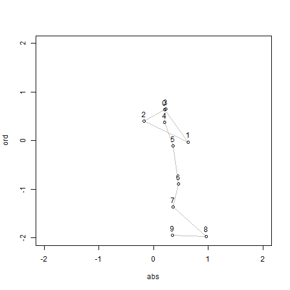 

*Description of the observations*

The observer stands at position (0,0) and only gets angle of the object. Also, there is a little uncertainty of measurement for this angle (modeled with a Normal distribution with variance 0.01).

The first observed angles are plotted in the following graph (with blue points):

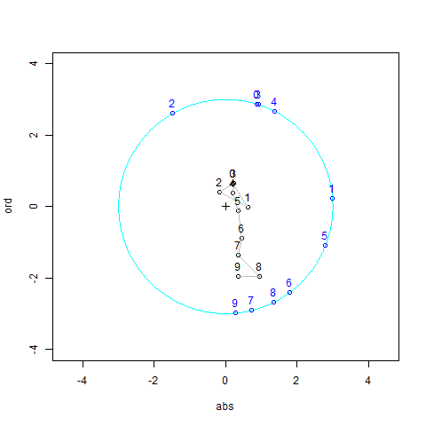 

In the following, we first describe the process of sampling with SIS and SISR. Then, we compare the two algorithms.

**Sampling results**

The aim of the algorithms is to define a sample of trajectories following the  distribution of the underlying model of X knowing Y. Each term of the sample is called a particle. Each particle is associated with a weight, representing the probability of that particle being sampled from the distribution. In the following plots, the numbers near trajectories correspond to the **normalized** weights over the particles.

*Sampling with SIS*

We draw the first three steps (with 20 particles). We can show that quickly, only one trajectory has a positive normalized weight.

First step:

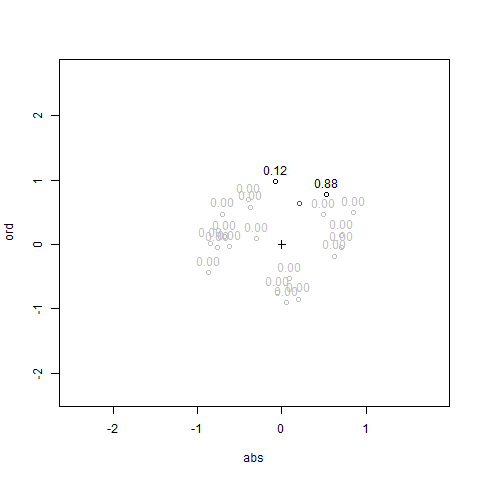 

Second step:

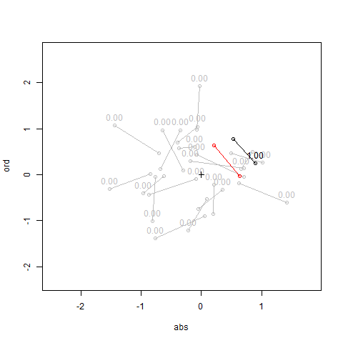 

Third step:

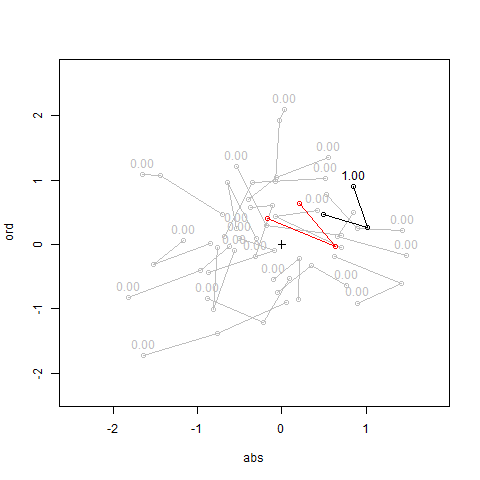 

*Sampling with SISR*

In SISR, we add a resampling phase between each step. The resampling is defined with respect to the weights.

First step:

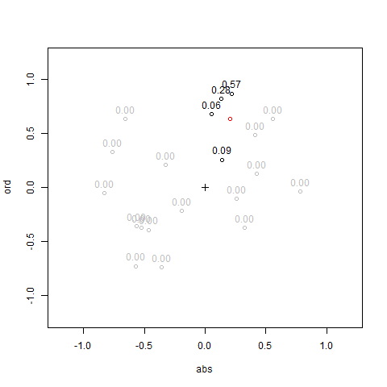 

Resampling after the first step:

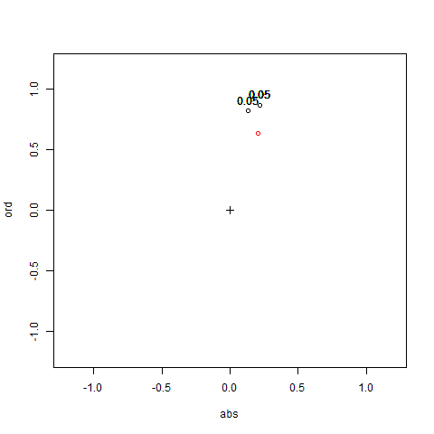 

Second step:

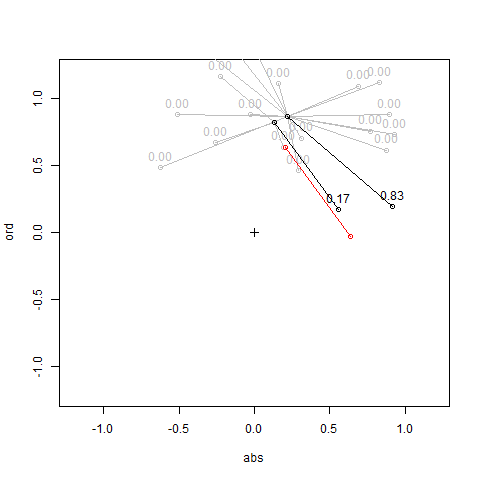 

Resampling after the second step:

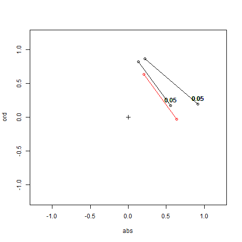 

**Comparison results**

We take a trajectory of length 100 and sample 10000 particles.

*Comparison of weights between SIS and SISR*

In SIS, only one trajectory has a positive normalized weight. This is known as the degeneracy problem:

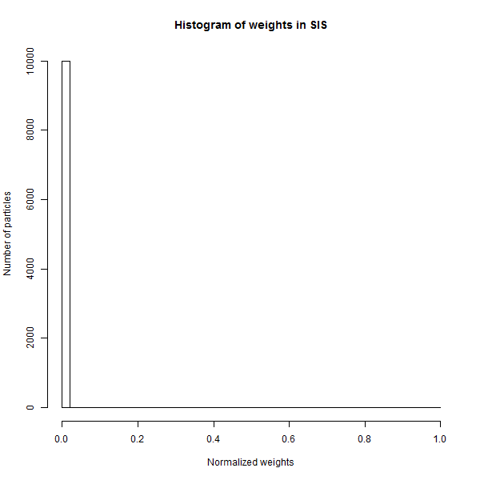 

Adding the resampling phase in SISR, the degeneracy problem is circumvented:

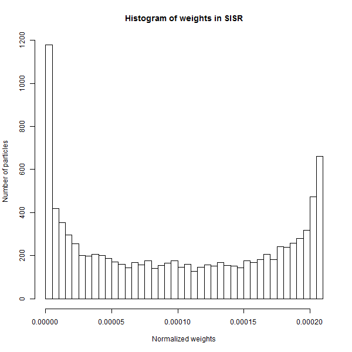 

*Comparison of sampled trajectories between SIS and SISR*

In SIS, the sampled trajectories did not adapt themselves to the observations:

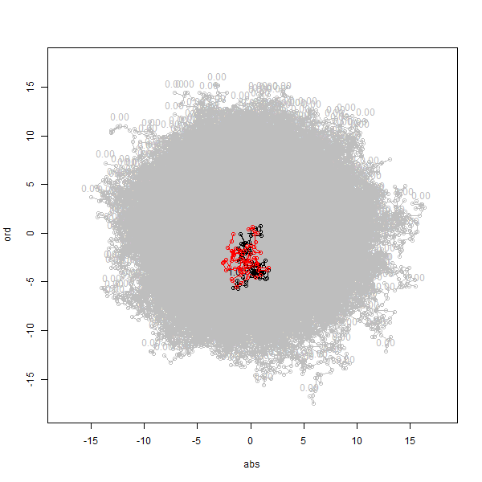 

Adding the resampling phase, we observe better trajectories (this is not perfect because we only have access to partial information):

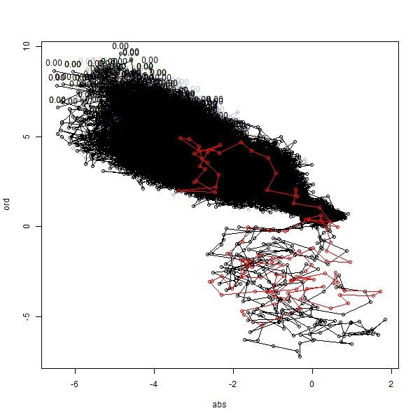 

*Comparison of the trajectory for the best particle with SIS and SISR*

We show the observations for the best particle, i.e. the particle with the highest normalized weight after the 100 steps. As before, the result is much better for the SISR algorithm.

With SIS:

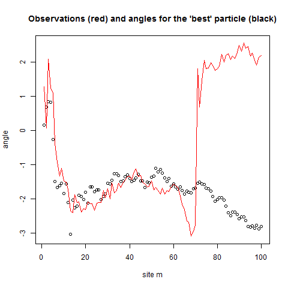 

With SISR:

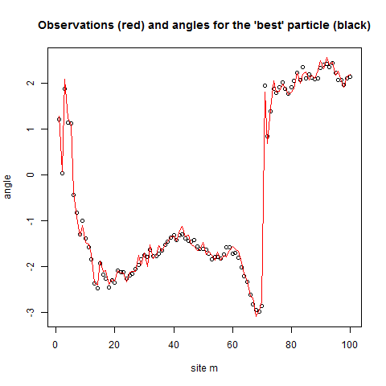 

